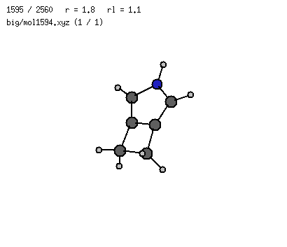
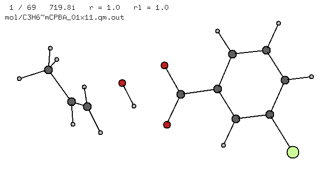
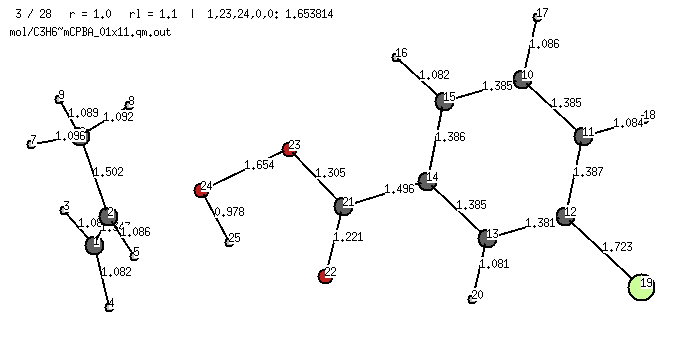
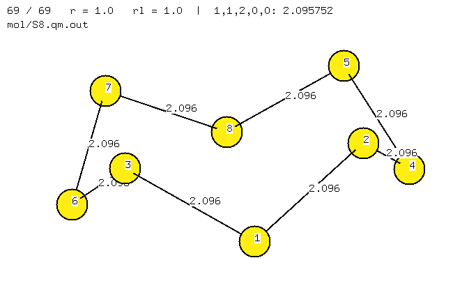
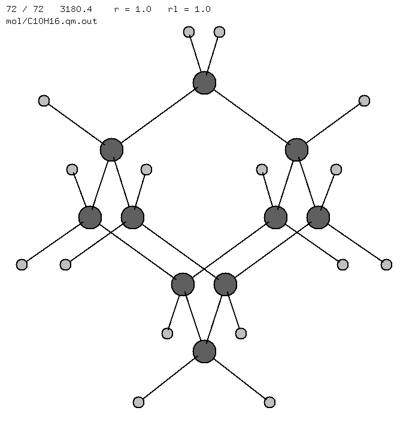
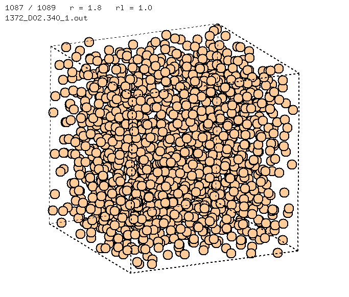
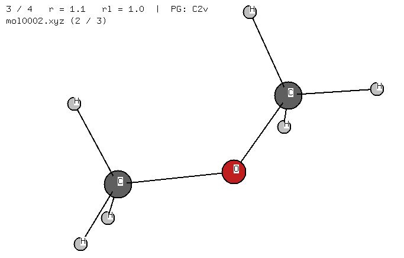
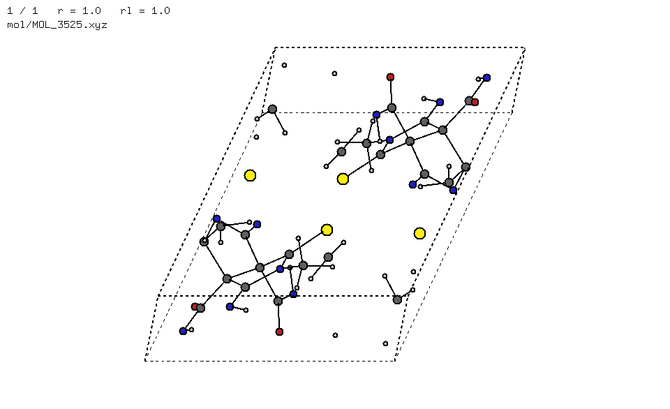
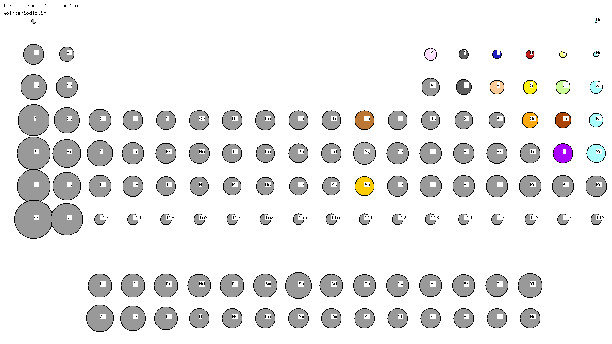

# v

A simple viewer for
[Priroda](http://rad.chem.msu.ru/~laikov) outputs,
[`.xyz`](https://en.wikipedia.org/wiki/XYZ_file_format) files,
and beyond.



## Contents
* [Download](#download-)
* [Build](#build-)
* [Usage](#usage-)
* [Examples](#examples-)

---

## Download [↑](#download)
```
wget https://github.com/briling/v/releases/download/v1.0/v.executable -O v
chmod +x ./v
```

## Build [↑](#contents)
```
make v
```

### Requirements:
* `GNU/Linux` or `Cygwin`
* `X11`
* `gcc >= 4.7`
* `libX11-devel`, `libXpm-devel`, `xproto-devel`
* `make`

## Usage [↑](#contents)
```
./v file [file2 ... fileN] [options]
```
Show the reference:
```
./v
```

<details open><summary><strong>Command-line options</strong></summary>

|                          |                                                               |
| ------------------------ | ------------------------------------------------------------- |
| `vib:%d`                 |     force to show geometries (`0`) / vibrations (`1`)         |
| `bonds:0`                |     disable bonds                                             |
| `bohr:1`                 |     assume input files are in Bohr (default is Å)             |
| `dt:%lf`                 |     delay between frames in seconds (default 0.02)            |
| `symtol:%lf`             |     tolerance for symmetry determination in Å (default 0.001) |
| `z:%d,%d,%d,%d,%d`       |     show an internal coordinate (`1,i,j,0,0` — distance i-j; `2,i,j,k,0` — angle i-j-k; `3,i,j,k,l` — torsion i-j-k-l) |
| `rot:%lf,%lf,%lf,%lf,%lf,%lf,%lf,%lf,%lf`   | rotation matrix to start with (default identity matrix)  |
| `font:%s`                |     font ([xlfd](https://en.wikipedia.org/wiki/X_logical_font_description)) |
| `cell:b%lf,%lf,%lf`                         | cuboid size in a.u. (for periodical boundary conditions) |
| `cell:%lf,%lf,%lf`                          | cuboid size in Å                                         |
| `cell:b%lf,%lf,%lf,%lf,%lf,%lf,%lf,%lf,%lf` | cell parameters in a.u.                                  |
| `cell:%lf,%lf,%lf,%lf,%lf,%lf,%lf,%lf,%lf`  | cell parameters in Å                                     |
| `shell:b%lf,%lf`                            | spheres radii in a.u.                                    |
| `shell:%lf,%lf`                             | spheres radii in Å                                       |

</details>

<details open><summary><strong>Keyboard reference</strong></summary>

|                                |                                                           |
| ------------------------------ |---------------------------------------------------------- |
| `←`/`↑`/`→`/`↓`/`pgup`/`pgdn`  |  rotate (slower with `ctrl` or `shift`)
| `w`/`a`/`s`/`d` or `↑`/`←`/`↓`/`→` on numpad |  move   (slower with `ctrl` or `shift`)
|                                |
| `0`                            |  go to the first point
| `=`                            |  go to the last point
| `enter`/`backspace`            |  next/previous point
| `ins`                          |  play forwards  / stop (vibration mode: animate selected normal mode / stop)
| `del`                          |  play backwards / stop
|                                |
| `home`/`end`                   |  zoom in/out
| `1`/`2`                        |  scale bond lengths
| `3`/`4`                        |  scale atom sizes
|                                |
| `.`                            |  show point group
|                                |
| `n`                            |  show/hide atom numbers
| `t`                            |  show/hide atom types
| `l`                            |  show/hide bond lengths
| `b`                            |  show/hide bonds
|                                |
| `tab`                          |  read new points
| `r`                            |  reread file
| `x`                            |  print molecule (Priroda input + bonds)
| `z`                            |  print molecule (`.xyz`) 
| `p`                            |  print molecule (input for an `.svg` generator)
| `u`                            |  print current rotation matrix
| `m`                            |  save the current frame ([`.xpm`](https://en.wikipedia.org/wiki/X_PixMap) format)
| `f`                            |  save all frames (vibration mode: save all frames to animate the selected normal mode)
|                                |
| `q`                            |  quit

</details>

<details open><summary><strong>Mouse</strong></summary>
One can also use the mouse to rotate the molecule and zoom in/out (in development).
</details>

## Examples [↑](#contents)
* `mol/C3H6~mCPBA_01x11.qm.out` — geometries + vibrations
```
./v mol/C3H6~mCPBA_01x11.qm.out font:-*-*-medium-*-*--15-*-*-*-*-*-*-1
```

```
./v mol/C3H6~mCPBA_01x11.qm.out vib:0 z:1,23,24,0,0
```

* `mol/S8.qm.out`     — geometries
```
./v mol/S8.qm.out z:1,1,2,0,0 font:-*-*-medium-*-*--15-*-*-*-*-*-*-1
```

* `mol/C10H16.qm.out` — vibrations
```
./v mol/C10H16.qm.out font:-*-*-medium-*-*--15-*-*-*-*-*-*-1
```

* `mol/1372_D02.340_1.out` — PBC simulation
```
./v mol/1372_D02.340_1.out bonds:0 cell:b10.7,10.7,1.07 font:-*-*-medium-*-*--15-*-*-*-*-*-*-1
```

* `mol/mol0001.xyz`, `mol/mol0002.xyz` — `.xyz` files with atomic numbers and atomic symbols
```
./v mol/mol0001.xyz mol/mol0002.xyz symtol:1e-2 font:-*-*-medium-*-*--15-*-*-*-*-*-*-1
```


* `mol/MOL_3525.xyz` — organic crystal with non-orthogonal cell
```
./v mol/MOL_3525.xyz cell:8.929542,0.0,0.0,4.197206,8.892922,0.0,0.480945,2.324788,10.016044 font:-*-*-medium-*-*--15-*-*-*-*-*-*-1
```


---

